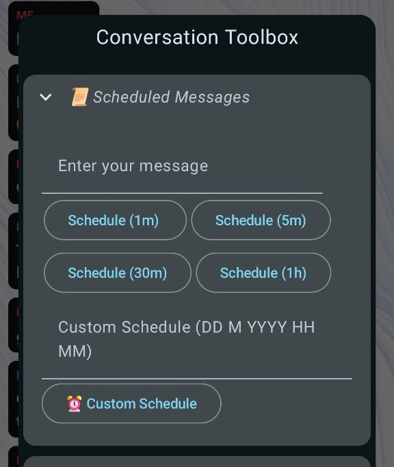
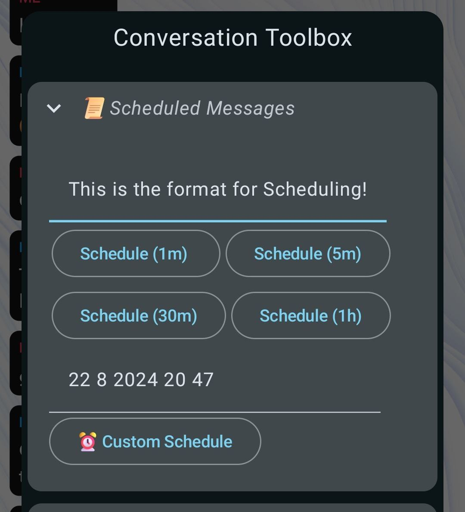
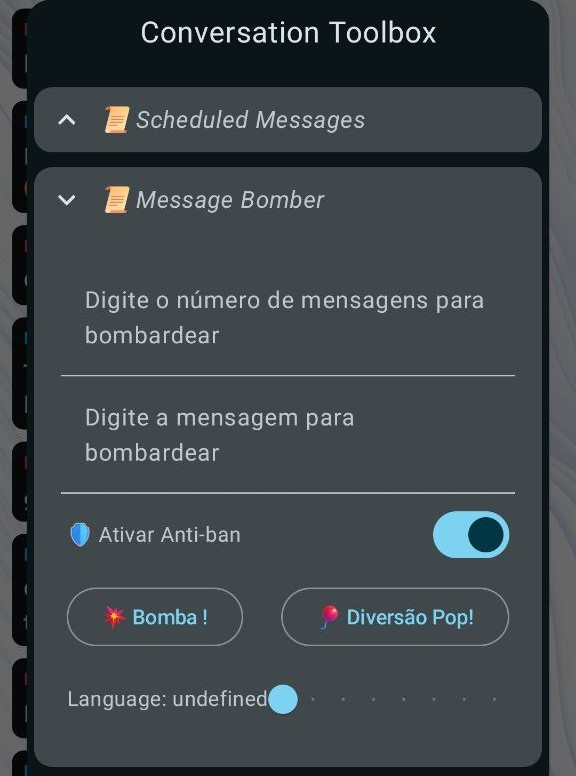
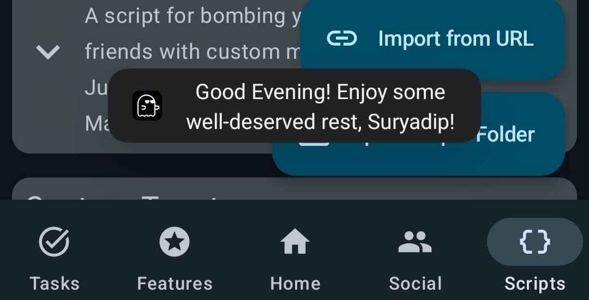
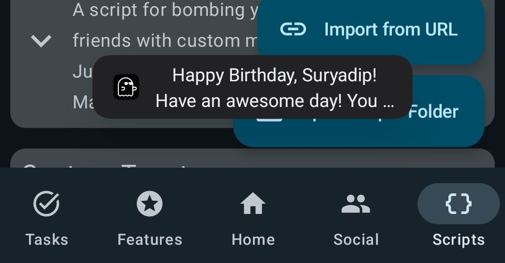

# SE-Scripts

A Scripts Repository for Snapenhance meant to enhance your Snapchat experience.

## Table of Contents

# Scripts
- [Scheduled Messages](#scheduled-messages)
- [Message Bomber](#message-bomber)
- [Greetings Toast](#greetings-toast)
- [Flexi Quotes](#flexi-quotes)
- [Custom Reminders](#custom-reminders)
- [Saved Replies](#saved-replies)
- [Custom Toast](#custom-toast)
- [Daily News](#daily-news)

# Use
- [How to Use](#how-to-use)

# Trouble Shooting 
- [Troubleshooting](#troubleshooting)

# Discontinued Versions
- [Discontinued Versions](#deprecated-versions)

## Scheduled Messages

- **Name:** scheduled_messages
- **Version:** 2.6
- **Last Updated:** September 05, 2024
- **Author:** Suryadip Sarkar
- **Credits:** rhunk & Jacob Thomas
- **Requirements:** Only works on SE versions released after 20/08/24
- **Description:** A Script That Allows For Scheduling Messages. Please don't remove Snapchat from the background when your message is scheduled.

## Download 

To download the latest version of the script, choose one of the following options:

1. **Download from GitHub:**

   Click the link below to download `Scheduled Messages` directly from GitHub:

   [Download Scheduled Messages](https://github.com/suryadip2008/SE-Scripts/blob/main/scripts/scheduled_messages.js)

2. **Import from URL:**

   Copy & paste this url in the `Import from URL` button in the scripts tab.

   [Press & Hold to Copy URL](https://raw.githubusercontent.com/suryadip2008/SE-Scripts/main/scripts/scheduled_messages.js)
   
## Features 

1. **Quick Schedule Options:**
   - Includes four preset scheduling buttons: 1 minute, 5 minutes, 30 minutes, and 1 hour. These options allow users to quickly set a message to be sent after the selected interval, making it easy to manage messaging without constant monitoring.

2. **Custom Scheduling:**
   - Allows users to set a custom time for sending messages, providing flexibility for specific needs. This feature ensures that users can plan their messaging schedule with precision beyond the preset options.
  
3. **Translations:**
   - Added Translations for 7 languages i.e. English, Portugese, Punjabi, French, German, Russian & Arabic!
  
4. **Recurring Schedule:**
   - The recurring schedule feature will help you to schedule any recurring message. For example: If I want to send Good Morning to my friend everyday, I just write Good Morning in the Recurring Message Field and Set the slider to Daily and click on the Recurring Schedule Button(Please note: the recurring message will be sent from the next day).

   ## Screenshots:

    

  
  

## Message Bomber

- **Name:** message_bomber
- **Version:** 5.5
- **Last Updated:** September 06, 2024
- **Author:** Suryadip Sarkar
- **Description:** A script for bombing your friends with custom messages. Just for educational purposes. May or May not cause bans.

 ## Download 

To download the latest version of the script, choose one of the following 

 1. **Download from GitHub:**

   Click the link below to download `Message Bomber` directly from GitHub:

   [Download Message Bomber](https://github.com/suryadip2008/SE-Scripts/blob/main/scripts/message_bomber.js)
   
  
  2. **Import from URL:**

   Copy & paste this url in the `Import from URL` button in the scripts tab.

   [Press & Hold to Copy URL](https://raw.githubusercontent.com/suryadip2008/SE-Scripts/main/scripts/message_bomber.js)

## Features

1. **Customizable Message Bombing:**
   - Users can specify the number of times they want the recipient to receive messages, allowing for tailored message bombing.
  
2. **Anti-Ban Features:**
   - New Anti-Ban Features have been added! To use the new anti-ban features, click on the toolbox, then click on Message Bomber and turn on "Enable Anti-Ban".

3. **Custom Message Input:**
   - Users can enter custom messages to be used for the message bombing, providing flexibility in content.
  
4. **Schedule Bomb Feature:**
   - Now you can schedule your bomb message in the format DD M YYYY HH MM. 

5. **Enhanced User Experience:**
   - Added icons for the "Message Bomb" button, improving visual appeal and user interaction.
  
6. **Translations:**
   - Added Translations for 7 languages i.e. English, Portugese, Punjabi, French, German, Russian & Arabic!

   ## Screenshots:
  
  

  
  

## Greetings Toast

- **Name:** greetings_toast
- **Version:** 3.0
- **Last Updated:** August 02, 2024
- **Author:** Suryadip Sarkar
- **Description:** A Script that shows a greetings toast on the startup of Snapchat.

## Download 

To download the latest version of the script, choose one of the following options:

1. **Download from GitHub:**

   Click the link below to download `Greetings Toast` directly from GitHub:

   [Download Greetings Toast](https://github.com/suryadip2008/SE-Scripts/blob/main/scripts/greetings_toast.js)

2. **Import from URL:**

   Copy & paste this url in the `Import from URL` button in the scripts tab.

   [Press & Hold to Copy URL](https://raw.githubusercontent.com/suryadip2008/SE-Scripts/main/scripts/greetings_toast.js)
   
## Features

1. **Dynamic Greetings:**
   - Greets users based on the time of day (Good Morning, Good Afternoon, Good Evening).
   - Users can select their preferred tone of Greetings: Formal, Informal & Humorous.
   - Special birthday greeting when it’s the user’s birthday.

2. **User Input:**
   - Users can input their username and date of birth in the format: `username dd/mm/yyyy`.

3. **Diverse Greeting Presets:**
   - 30 unique presets for each greeting category (Good Morning, Good Afternoon, Good Evening, and Happy Birthday), ensuring varied and engaging messages.

4. **Test Functionality:**
   - Includes a test button to allow users to immediately test changes without reopening Snapchat.

5. **Input Validation:**
   - Checks for empty input fields and displays a toast message: "Please enter your username and date of birth first."
   - Validates the date format and shows a toast message if the format is incorrect: "Invalid date format. Please use dd/mm/yyyy."
   - Ensures the correct input format for username and date of birth, with a toast message for invalid input: "Invalid Input format. Please use 'username dd/mm/yyyy'."

## Screenshots:

  

  
  

   
