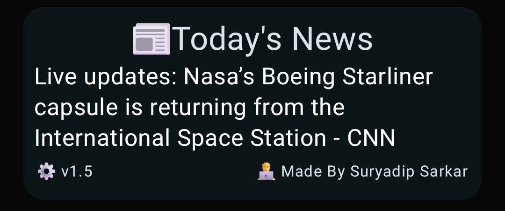

# SE-Scripts

A Scripts Repository for Snapenhance meant to enhance your Snapchat experience.

> [!Caution]  
> This project is now abandoned and won't be maintained again.

## 📖 Scripts

  
💣 Message Bomber

  
- **Name:** message_bomber
- **Version:** 5.8
- **Last Updated:** October 25, 2024
- **Author:** ΞTΞRNAL
- **Description:** A script for bombing your friends with custom messages. Just for educational purposes. May or May not cause bans.

 ## Features
  
- `Customizable Message Bombing`
- `Anti Ban Features`
- `Custom Message Input`
- `Schedule Bomb Feature`
- `Enhanced User Experience`
- `Translations`

## Download 

1. **Import from URL:**

   Copy & paste this url in the `Import from URL` button in the scripts tab.

   [Press & Hold to Copy URL](https://raw.githubusercontent.com/suryadip2008/SE-Scripts/main/scripts/message_bomber.js)

2. **Download from GitHub:**

   Click the link below to download `Message Bomber` directly from GitHub:

   [Download Message Bomber](https://github.com/suryadip2008/SE-Scripts/blob/main/scripts/message_bomber.js)

## Screenshots

  
  

 📩 Scheduled Messages 

- **Name:** scheduled_messages
- **Version:** 2.6
- **Last Updated:** September 05, 2024
- **Author:** ΞTΞRNAL
- **Credits:** rhunk & Jacob Thomas
- **Requirements:** Only works on SE versions released after 20/08/24
- **Description:** A Script That Allows For Scheduling Messages. Please don't remove Snapchat from the background when your message is scheduled.

## Features

- `Quick Schedule Option`
- `Custom Scheduling`
- `Translations`
- `Recuring Schedule`

## Download 

To download the latest version of the script, choose one of the following options:

1. **Import from URL:**

   Copy & paste this url in the `Import from URL` button in the scripts tab.

   [Press & Hold to Copy URL](https://raw.githubusercontent.com/suryadip2008/SE-Scripts/main/scripts/scheduled_messages.js)

2. **Download from GitHub:**

   Click the link below to download `Scheduled Messages` directly from GitHub:

   [Download Scheduled Messages](https://github.com/suryadip2008/SE-Scripts/blob/main/scripts/scheduled_messages.js)
  
## Screenshots

  

  
  
  

 🌸 Greetings Toast 

- **Name:** greetings_toast
- **Version:** 3.0
- **Last Updated:** August 02, 2024
- **Author:** ΞTΞRNAL
- **Description:** A Script that shows a greetings toast on the startup of Snapchat.

## Features 

- `Dynamic Greetings`
- `User Input`
- `Diverse Greeting Presets`
- `Test Functionality`
- `Input Validation`

## Download 

To download the latest version of the script, choose one of the following options:

1. **Import from URL:**

   Copy & paste this url in the `Import from URL` button in the scripts tab.

   [Press & Hold to Copy URL](https://raw.githubusercontent.com/suryadip2008/SE-Scripts/main/scripts/greetings_toast.js)

2. **Download from GitHub:**

   Click the link below to download `Greetings Toast` directly from GitHub:

   [Download Greetings Toast](https://github.com/suryadip2008/SE-Scripts/blob/main/scripts/greetings_toast.js)

## Screenshots

  

  
  

 🌙 Flexi Quotes 

- **Name:** flexi_quotes
- **Version:** 5.0
- **Last Updated:** August 15, 2024
- **Author:** ΞTΞRNAL & Jacob Thomas
- **Description:** A Script that shows a random motivation quote dialog on the startup of Snapchat.

## Features 

- `Extensive Quote Collection`
- `Dual Display`
- `Customizable font & Color`
- `Customizable Display Mode`
- `Hex Code Testing`
- `Motivate Your Friends`

## Download

To download the latest version of the script, choose one of the following options:

1. **Import from URL:**

   Copy & paste this url in the `Import from URL` button in the scripts tab.

   [Press & Hold to Copy URL](https://raw.githubusercontent.com/suryadip2008/SE-Scripts/main/scripts/flexi_quotes.js)

2. **Download from GitHub:**

   Click the link below to download `Flexi Quotes` directly from GitHub:

   [Download Flexi Quotes](https://github.com/suryadip2008/SE-Scripts/blob/main/scripts/flexi_quotes.js)

## Screenshots
  
  

  
  

 🥹 Custom Reminders

 **Name:** custom_reminders
- **Version:** 1.0
- **Last Updated:** July 18, 2024
- **Author:** ΞTΞRNAL
- **Description:** A Script that shows custom reminders with countdowns based on specified dates.

## Features 

- `Custom Message Input`
- `Dynamic Countdown Messages`
- `Testing Functionality`
- `Input Validation Checks`

## Download 

To download the latest version of the script, choose one of the following options:

1. **Import from URL:**

   Copy & paste this url in the `Import from URL` button in the scripts tab.

   [Press & Hold to Copy URL](https://raw.githubusercontent.com/suryadip2008/SE-Scripts/main/scripts/custom_reminders.js)

2. **Download from GitHub:**

   Click the link below to download `Custom Reminders` directly from GitHub:

   [Download Custom Reminders](https://github.com/suryadip2008/SE-Scripts/blob/main/scripts/custom_reminders.js)

## Screenshots
 
  

  
  

 🪷 Saved Replies 

  
- **Name:** saved_replies
- **Version:** 1.5
- **Last Updated:** July 22, 2024
- **Author:** ΞTΞRNAL
- **Description:** A Script That Allows Users to Save and Send Custom Replies

## Features 

- `Saved Replies Functionality`
- `View Saved Replies`
- `Direct Action On Saved Replies`
- `Persistence Of Saved Replies`
- `User Interface Enhancements`
 
## Download 

To download the latest version of the script, choose one of the following options:

1. **Import from URL:**

   Copy & paste this url in the `Import from URL` button in the scripts tab.

   [Press & Hold to Copy URL](https://raw.githubusercontent.com/suryadip2008/SE-Scripts/main/scripts/saved_replies.js)
   
2. **Download from GitHub:**

   Click the link below to download `Saved Replies` directly from GitHub:

   [Download Saved Replies](https://github.com/suryadip2008/SE-Scripts/blob/main/scripts/saved_replies.js)
  
## Screenshots
  
  

  
  

 🦹🏻 Daily News 

  
- **Name:** daily_news
- **Version:** 2.2
- **Last Updated:** Daily
- **Author:** ΞTΞRNAL
- **Description:**  A script that shows daily news as a dialog on Snapchat startup.

## Features 

- `Fetch Daily News`
- `Display Daily News In Dialogue`
- `Font Size`
- `Font Color`
- `Hex Code Validation`
- `Refresh Button`
- `Translations`
- `More Script Button`
- `Info Button`

## Download 

To download the latest version of the script, choose one of the following options:

1. **Import from URL:**

   Copy & paste this url in the `Import from URL` button in the scripts tab.

   [Press & Hold to Copy URL](https://raw.githubusercontent.com/suryadip2008/SE-Scripts/main/scripts/daily_news.js)

2. **Download from GitHub:**

   Click the link below to download `Daily News` directly from GitHub:

   [Download Daily News](https://github.com/suryadip2008/SE-Scripts/blob/main/scripts/daily_news.js)

## Screenshots

  

  
  

  
 🐥 Custom Toast 

- **Name:** custom_toast
- **Version:** 1.5
- **Last Updated:** July 20, 2024
- **Author:** Gabriel Modz, Jacob Thomas & ΞTΞRNAL
- **Description:** A Script that shows a custom toast on the startup of Snapchat.

## Features 

- `Custom Message Toast`
- `Testing Functionality`

## Download 

To download the latest version of the script, choose one of the following options:

1. **Import from URL:**

   Copy & paste this url in the `Import from URL` button in the scripts tab.

   [Press & Hold to Copy URL](https://raw.githubusercontent.com/suryadip2008/SE-Scripts/main/scripts/custom_toast.js)
   
2. **Download from GitHub:**

   Click the link below to download `Custom Toast` directly from GitHub:

   [Download Custom Toast](https://github.com/suryadip2008/SE-Scripts/blob/main/scripts/custom_toast.js)

## Screenshots

  

  
  

## Install SE / SE-EXTENDED 

  
 🦋 How to use 

  
Follow these steps to install and use the script:

1. **Download & Install Snapenhance/SE Extended:**

   *Ignore this step if you already have Snapenhance/SE Extended installed.*

   Click on this link for furthur instructions on how to install `Snapenhance`:
   
   [Installation Guide](https://github.com/rhunk/SnapEnhance/wiki/Installation-Guide)

                                      OR

   Click on this link for furthur instructions on how to install `SE Extended`:
   
   [Installation Guide](https://github.com/bocajthomas/SE-Extended/wiki/Installation-Guide)

3. **Download the Script(Follow either of the two methods):**

   - **Download from GitHub:**
     - The link will open the script file on GitHub.
     - Click on the three dots icon on the top right corner & then click on the "Download" button.

   - **Import from URL:**
     - Copy the url by pressing and holding it and then paste it in the `Import from URL` button in the Scripts tab of SE/SE Extended.
       
4. **Installation:**
   *Ignore this step if you have followed the `Import from URL` Method*
   - Copy the script to your Scripts folder.

5. **Enable the Script:**

   - Open SE/SE Extended.
   - Navigate to the 'Scripts' section and enable the script.

6. **Configuration:**

   - Go to the script settings to customize options like custom toast, username, date of birth, etc.

   

## Troubleshooting

   

  
 🌔 FAQS 

- **Failed to Import Script!**
  - You have to first give SE access to your Scripts Folder.(To do this, head over to the Scripts Tab in SE/SE Extended)
 
- **SE/SE Extended crashes when I import the script/When I open the `Scripts` Tab!!**
  - This is due to duplicate scripts existing in your scripts folder. Head over to your File Manager and navigate to your Scripts Folder and Delete all the duplicate scripts.
 
- **Tapping on Import From URL Button Does Nothing!**
  - Please follow the `Download from GitHub` method.

- **Script Not Working:**
  - Ensure the script is placed in the correct folder.
  - Check if the script is enabled in SE/SE Extended.

- **Toasts not showing up sometimes**
  - Scripts like custom_toast.js, greetings_toast.js, etc which are based on toasts require Snapchat to be closed completely then opened. If you have just pressed the home button to exit Snapchat and reopened Snapchat again, the toast might not show up. You also need to clear Snapchat from the recents menu or exit it properly in order for the toast to show up.

 

## Versions

 

  
 📜 Deprecated Versions

   Deprecated versions of the scripts can be found here : [Link](https://github.com/suryadip2008/SE-Scripts/blob/main/scripts/deprecated/Deprecated.md)

## Contact Us

 💭 Contact Us 

If you encounter any issues with these script, feel free to contact me : https://t.me/particle_box
If you have any suggestions PM me right here, https://t.me/za1n_al1

