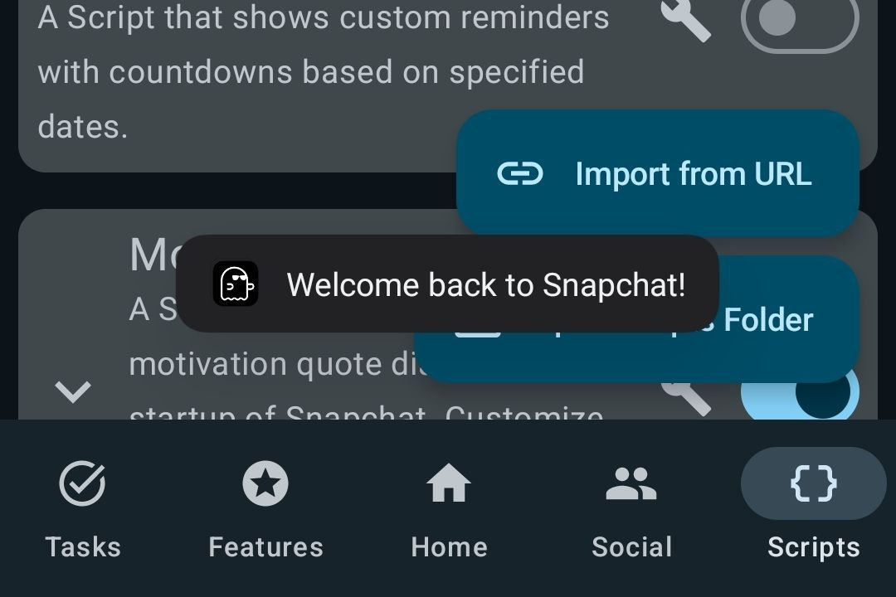
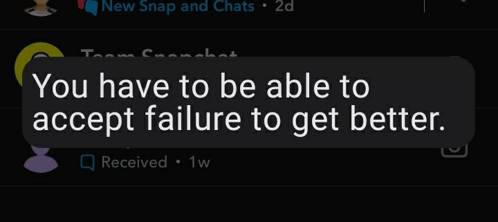
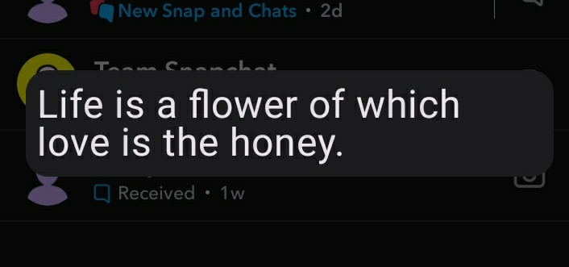
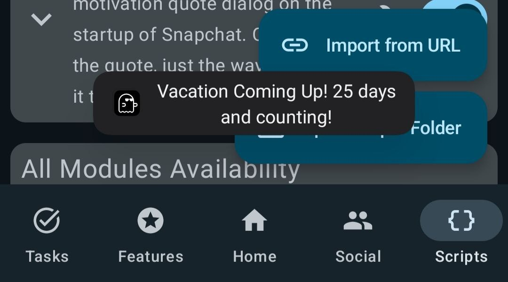
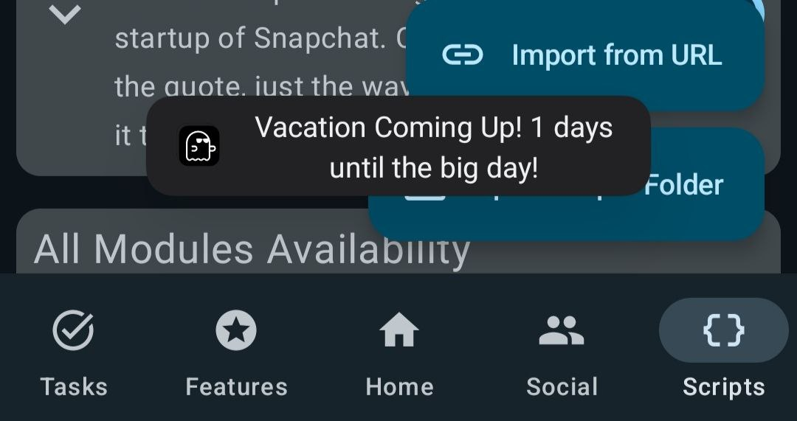
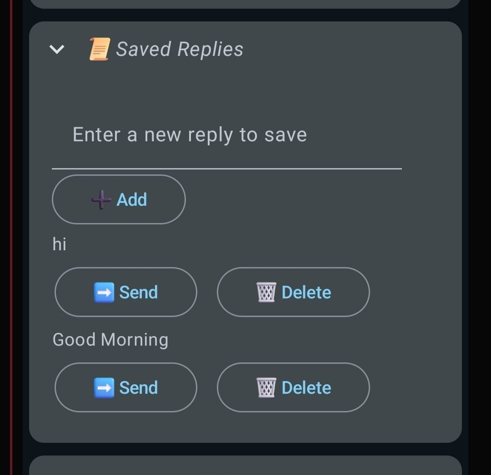
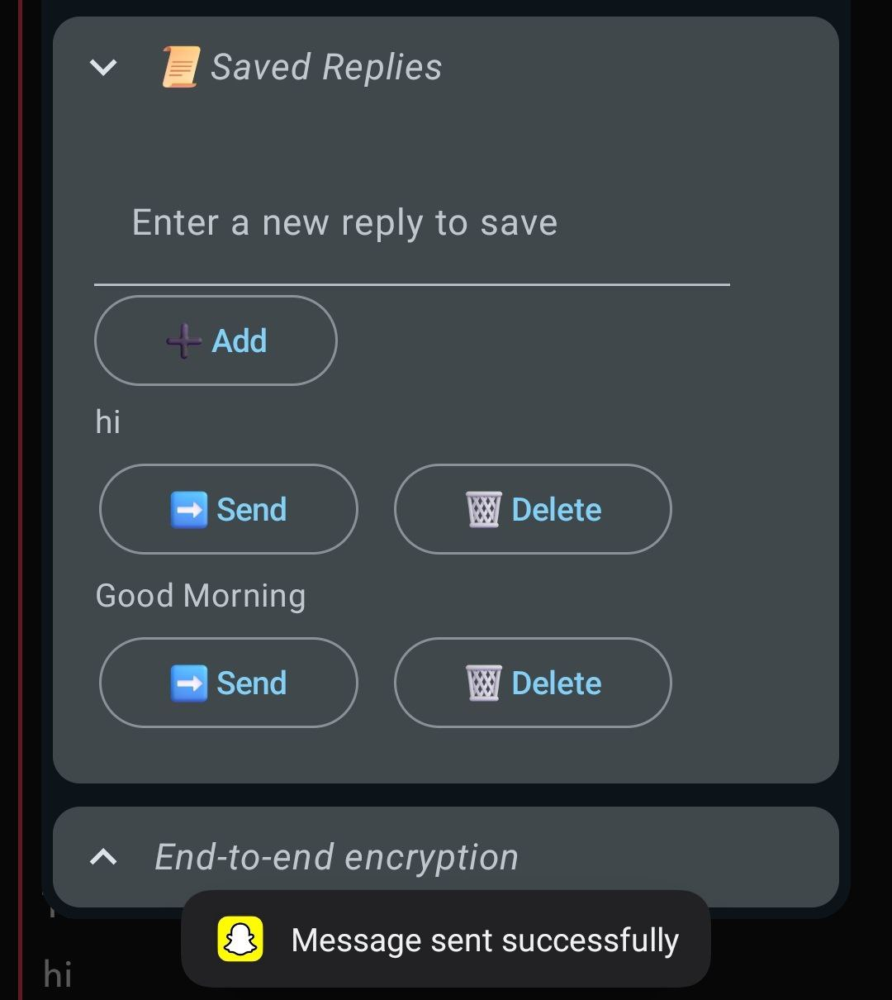

# SE-Scripts

A Scripts Repository for Snapenhance meant to enhance your Snapchat experience.

## Table of Contents

- [Script Feature Overviews](#script-feature-overviews)
- [Scheduled Messages](#scheduled-messages)
- [Custom Toast](#custom-toast)
- [Greetings Toast](#greetings-toast)
- [Flexi Quotes](#flexi-quotes)
- [Custom Reminders](#custom-reminders)
- [Message Bomber](#message-bomber)
- [Saved Replies](#saved-replies)
- [Screenshots](#screenshots)
- [How to Use](#how-to-use)
- [Troubleshooting](#troubleshooting)
- [Discontinued Versions](#deprecated-versions)

# Script Feature Overviews

## scheduled_messages.js

1. **Quick Schedule Options:**
   - Includes four preset scheduling buttons: 1 minute, 5 minutes, 30 minutes, and 1 hour. These options allow users to quickly set a message to be sent after the selected interval, making it easy to manage messaging without constant monitoring.

2. **Custom Scheduling:**
   - Allows users to set a custom time for sending messages, providing flexibility for specific needs. This feature ensures that users can plan their messaging schedule with precision beyond the preset options.
  
[Jump to Script Details](#scheduled-messages)

## custom_toast.js

1. **Custom Message Toast:**
   - Allows users to enter their favorite message to be displayed as a toast notification, enabling a personalized experience.

2. **Testing Functionality:**
   - Added a "Test Custom Script" button below the text input field. This allows users to test the changes they have made without needing to reopen Snapchat repeatedly, providing immediate feedback on their custom messages.

[Jump to Script Details](#custom-toast)

## greetings_toast.js

1. **Dynamic Greetings:**
   - Greets users based on the time of day (Good Morning, Good Afternoon, Good Evening).
   - Users can select their preferred tone of Greetings: Formal, Informal & Humorous.
   - Special birthday greeting when it’s the user’s birthday.

2. **User Input:**
   - Users can input their username and date of birth in the format: `username dd/mm/yyyy`.

3. **Diverse Greeting Presets:**
   - 30 unique presets for each greeting category (Good Morning, Good Afternoon, Good Evening, and Happy Birthday), ensuring varied and engaging messages.

4. **Test Functionality:**
   - Includes a test button to allow users to immediately test changes without reopening Snapchat.

5. **Input Validation:**
   - Checks for empty input fields and displays a toast message: "Please enter your username and date of birth first."
   - Validates the date format and shows a toast message if the format is incorrect: "Invalid date format. Please use dd/mm/yyyy."
   - Ensures the correct input format for username and date of birth, with a toast message for invalid input: "Invalid Input format. Please use 'username dd/mm/yyyy'."

[Jump to Script Details](#greetings-toast)

## flexi_quotes.js

1. **Extensive Quote Collection:**
   - Preloaded with over 150+ motivational quotes.
   - Displays a random motivational quote each time Snapchat is opened.

2. **Dual Display:**
   - Utilizes both toast & dialog interface.

3. **Customizable Font Size & Color:**
   - Users can customize the font size of the motivation dialog text.
   - Includes a font size slider in the settings for easy adjustment.
   - Users can change the font color of the motivation dialog text.
   - Features a text input field for entering custom HEX codes.

4. **Customizable Display Mode:**:
   - Users can choose whether to display the quote as a toast or a dialog!

5. **HEX Code Testing:**
   - Includes a "Test HEX Code" button to verify that the entered HEX code displays the desired color.
  
6. **Motivate your friends!:**:
   - You can now send a random motivational quote to your friend by clicking on the `Send Motivational Quote` Button in the Toolbox.

[Jump to Script Details](#flexi-quotes)

## custom_reminders.js

1. **Custom Message Input:**
   - Two input fields provided:
     - Enter Custom Message: Allows users to input personalized reminder messages.
     - Enter Countdown Date: Users can specify a date for the countdown.

2. **Dynamic Countdown Messages:**
   - Countdown messages are preloaded with several phrases that change based on the number of days remaining until the specified date, providing timely and relevant reminders.

3. **Testing Functionality:**
   - Includes a test button in the settings, allowing users to test the script directly in SE without needing to reopen Snapchat, ensuring quick feedback on changes.

4. **Input Validation Checks:**
   - Several checks implemented to ensure proper user input:
     - Alerts the user if the date is entered in the wrong format.
     - Notifies users if only one input field is filled, ensuring both fields are completed for functionality.

[Jump to Script Details](#custom-reminders)

## message_bomber.js

1. **Customizable Message Bombing:**
   - Users can specify the number of times they want the recipient to receive messages, allowing for tailored message bombing.
  
2. **Anti-Ban Features:**
   - New Anti-Ban Features have been added! To use the new anti-ban features, click on the toolbox, then click on Message Bomber and turn on "Enable Anti-Ban".

2. **Custom Message Input:**
   - Users can enter custom messages to be used for the message bombing, providing flexibility in content.

3. **Enhanced User Experience:**
   - Added icons for the "Message Bomb" button, improving visual appeal and user interaction.
  
4. **Translations:**
   - Added Translations for 7 languages i.e. English, Portugese, Punjabi, French, German, Russian & Arabic!
  
[Jump to Script Details](#message-bomber)

## saved_replies.js

1. **Save Replies Functionality:**
   - Users can now save replies for quick access.
   - To save a reply, navigate to any chat, click on the toolbox icon, type the desired reply, and click the Add button.
   - A toast notification will confirm with "Reply added."

2. **View Saved Replies:**
   - After saving a reply, users must collapse and expand the Saved Replies flyout to see the newly added reply.

3. **Direct Action on Saved Replies:**
   - Saved replies can be sent or deleted directly from the toolbox.
   - Simply click the Send or Delete button below any saved reply for immediate action.

4. **Persistence of Saved Replies:**
   - Saved replies do not get automatically deleted when Snapchat is reopened, ensuring that users retain their saved responses.

5. **User Interface Enhancements:**
   - New Icons: Added icons for each button: Add, Delete, and Send for better visual representation.
  
[Jump to Script Details](#saved-replies)

# Scripts

## Scheduled Messages

- **Name:** scheduled_messages
- **Version:** 1.0
- **Last Updated:** August 22, 2024
- **Author:** Suryadip Sarkar
- **Credits:** rhunk & Jacob Thomas
- **Requirements:** Only works on SE versions released after 20/08/24
- **Description:** A Script That Allows For Scheduling Messages. Please don't remove Snapchat from the background when your message is scheduled.

To download the latest version of the script, choose one of the following options:

1. **Download from GitHub:**

   Click the link below to download `Scheduled Messages` directly from GitHub:

   [Download Scheduled Messages](https://github.com/suryadip2008/SE-Scripts/blob/main/scripts/scheduled_messages.js)

2. **Import from URL:**

   Copy & paste this url in the `Import from URL` button in the scripts tab.

   [Press & Hold to Copy URL](https://raw.githubusercontent.com/suryadip2008/SE-Scripts/main/scripts/scheduled_messages.js)

## Custom Toast

- **Name:** custom_toast
- **Version:** 1.5
- **Last Updated:** July 20, 2024
- **Author:** Gabriel Modz, Jacob Thomas & Suryadip Sarkar
- **Description:** A Script that shows a custom toast on the startup of Snapchat.

To download the latest version of the script, choose one of the following options:

1. **Download from GitHub:**

   Click the link below to download `Custom Toast` directly from GitHub:

   [Download Custom Toast](https://github.com/suryadip2008/SE-Scripts/blob/main/scripts/custom_toast.js)

2. **Import from URL:**

   Copy & paste this url in the `Import from URL` button in the scripts tab.

   [Press & Hold to Copy URL](https://raw.githubusercontent.com/suryadip2008/SE-Scripts/main/scripts/custom_toast.js)

## Greetings Toast

- **Name:** greetings_toast
- **Version:** 3.0
- **Last Updated:** August 02, 2024
- **Author:** Suryadip Sarkar
- **Description:** A Script that shows a greetings toast on the startup of Snapchat.

To download the latest version of the script, choose one of the following options:

1. **Download from GitHub:**

   Click the link below to download `Greetings Toast` directly from GitHub:

   [Download Greetings Toast](https://github.com/suryadip2008/SE-Scripts/blob/main/scripts/greetings_toast.js)

2. **Import from URL:**

   Copy & paste this url in the `Import from URL` button in the scripts tab.

   [Press & Hold to Copy URL](https://raw.githubusercontent.com/suryadip2008/SE-Scripts/main/scripts/greetings_toast.js)

## Flexi Quotes

- **Name:** flexi_quotes
- **Version:** 4.0
- **Last Updated:** August 15, 2024
- **Author:** Suryadip Sarkar & Jacob Thomas
- **Description:** A Script that shows a random motivation quote dialog on the startup of Snapchat.

To download the latest version of the script, choose one of the following options:

1. **Download from GitHub:**

   Click the link below to download `Flexi Quotes` directly from GitHub:

   [Download Flexi Quotes](https://github.com/suryadip2008/SE-Scripts/blob/main/scripts/flexi_quotes.js)

2. **Import from URL:**

   Copy & paste this url in the `Import from URL` button in the scripts tab.

   [Press & Hold to Copy URL](https://raw.githubusercontent.com/suryadip2008/SE-Scripts/main/scripts/flexi_quotes.js)

## Custom Reminders

- **Name:** custom_reminders
- **Version:** 1.0
- **Last Updated:** July 18, 2024
- **Author:** Suryadip Sarkar
- **Description:** A Script that shows custom reminders with countdowns based on specified dates.

To download the latest version of the script, choose one of the following options:

1. **Download from GitHub:**

   Click the link below to download `Custom Reminders` directly from GitHub:

   [Download Custom Reminders](https://github.com/suryadip2008/SE-Scripts/blob/main/scripts/custom_reminders.js)

2. **Import from URL:**

   Copy & paste this url in the `Import from URL` button in the scripts tab.

   [Press & Hold to Copy URL](https://raw.githubusercontent.com/suryadip2008/SE-Scripts/main/scripts/custom_reminders.js)

## Message Bomber

- **Name:** message_bomber
- **Version:** 5.0
- **Last Updated:** August 14, 2024
- **Author:** Suryadip Sarkar
- **Description:** A script for bombing your friends with custom messages. Just for educational purposes. May or May not cause bans.

To download the latest version of the script, choose one of the following options:

1. **Download from GitHub:**

   Click the link below to download `Message Bomber` directly from GitHub:

   [Download Message Bomber](https://github.com/suryadip2008/SE-Scripts/blob/main/scripts/message_bomber.js)

2. **Import from URL:**

   Copy & paste this url in the `Import from URL` button in the scripts tab.

   [Press & Hold to Copy URL](https://raw.githubusercontent.com/suryadip2008/SE-Scripts/main/scripts/message_bomber.js)

## Saved Replies

- **Name:** saved_replies
- **Version:** 1.5
- **Last Updated:** July 22, 2024
- **Author:** Suryadip Sarkar
- **Description:** A Script That Allows Users to Save and Send Custom Replies

To download the latest version of the script, choose one of the following options:

1. **Download from GitHub:**

   Click the link below to download `Saved Replies` directly from GitHub:

   [Download Saved Replies](https://github.com/suryadip2008/SE-Scripts/blob/main/scripts/saved_replies.js)

2. **Import from URL:**

   Copy & paste this url in the `Import from URL` button in the scripts tab.

   [Press & Hold to Copy URL](https://raw.githubusercontent.com/suryadip2008/SE-Scripts/main/scripts/saved_replies.js)

## Screenshots

Below are some screenshots demonstrating the script in action:

- ## Custom Toast:
  
  

  
  

- ## Greetings Toast:
  
  

  
  

- ## Flexi Quotes:
  
  

  
  

- ## Custom Reminders:
  
  

  
  

- ## Message Bomber:
  
  

  
  

- ## Saved Replies:
  
  

  
  

## How to Use

Follow these steps to install and use the script:

1. **Download the Script(Follow either of the two methods):**

   - **Download from GitHub:**
     - The link will open the script file on GitHub.
     - Click on the three dots icon on the top right corner & then click on the "Download" button.

   - **Import from URL:**
     - Copy the url by pressing and holding it and then paste it in the `Import from URL` button in the Scripts tab of SE.
       
2. **Installation:**
   *Ignore this step if you have followed the `Import from URL` Method*
   - Copy the script to your Scripts folder.

4. **Enable the Script:**

   - Open SE.
   - Navigate to the 'Scripts' section and enable the script.

5. **Configuration:**

   - Go to the script settings to customize options like custom toast, username, date of birth, etc.

## Troubleshooting

### FAQs

- **SE crashes when I import the script/When I open the `Scripts` Tab!!**
  - This is due to duplicate scripts existing in your scripts folder. Head over to your File Manager and navigate to your Scripts Folder and Delete all the duplicate scripts.

- **Failed to Import Script!**
  - You have to first give SE access to your Scripts Folder.(To do this, head over to the Scripts Tab in SE)
 
- **Tapping on Import From URL Button Does Nothing!**
  - Please follow the `Download from GitHub` method.

- **Script Not Working:**
  - Ensure the script is placed in the correct folder.
  - Check if the script is enabled in SE.

- **Toasts not showing up sometimes**
  - Scripts like custom_toast.js, greetings_toast.js, etc which are based on toasts require Snapchat to be closed completely then opened. If you have just pressed the home button to exit Snapchat and reopened Snapchat again, the toast might not show up. You also need to clear Snapchat from the recents menu or exit it properly in order for the toast to show up.
 
## Deprecated Versions

   Deprecated versions of the scripts can be found here : [Link](https://github.com/suryadip2008/SE-Scripts/blob/main/scripts/deprecated/Deprecated.md)

If you encounter any issues with these script, feel free to contact me : https://t.me/suryadip_sark08
